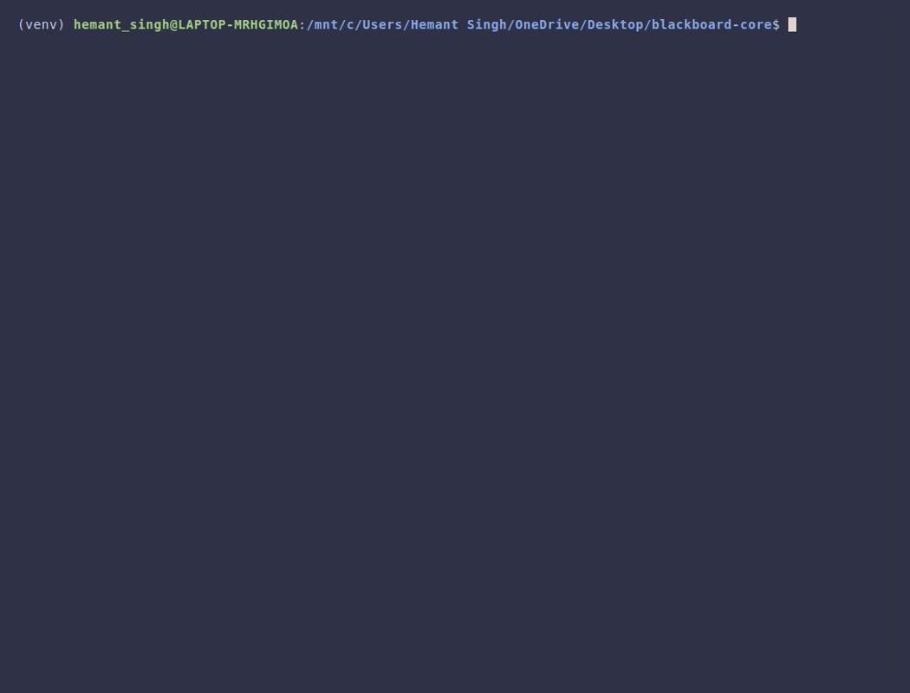

# Blackboard-Core

A Python SDK for building **LLM-powered multi-agent systems** using the Blackboard Pattern.

[](https://www.python.org/downloads/)
[](LICENSE)
[](https://pypi.org/project/blackboard-core/)

`

## What is Blackboard-Core?

Blackboard-Core provides a **centralized state architecture** for multi-agent AI systems. Instead of agents messaging each other directly, all agents read from and write to a shared **Blackboard** (state), while a **Supervisor LLM** orchestrates which agent runs next.

```
┌─────────────────────────────────────────────────────────────┐
│                       ORCHESTRATOR                          │
│  ┌─────────────┐    ┌──────────────────────────────────┐    │
│  │  Supervisor │──▶│          BLACKBOARD              │    │
│  │    (LLM)    │    │  • Goal      • Artifacts         │    │
│  └─────────────┘    │  • Status    • Feedback          │    │
│         │           │  • History   • Metadata          │    │
│         ▼           └──────────────────────────────────┘    │
│  ┌─────────────────────────────────────────────────────┐    │
│  │                       WORKERS                       │    │
│  │  [Writer]  [Critic]  [Refiner]  [Researcher]  ...   │    │
│  └─────────────────────────────────────────────────────┘    │
└─────────────────────────────────────────────────────────────┘
```

## Features

**Core**

- **Centralized State** - All agents share a typed Pydantic state model
- **LLM Orchestration** - A supervisor LLM decides which worker runs next
- **Magic Decorators** - Define workers with simple typed functions
- **Async-First** - Built for high-performance async/await patterns

**Orchestration**

- **Chain-of-Thought** - Pluggable reasoning strategies
- **Fractal Agents** - Nest agents as workers with recursion limits
- **Squad Patterns** - Pre-configured agent factories
- **Blueprints** - Constrain execution to specific workflows

**Persistence & Memory**

- **SQLite/Postgres** - Production-grade persistence
- **Time-Travel Debugging** - Fork sessions at any checkpoint
- **Vector Memory** - Semantic search with pluggable embedders

**Swarm Intelligence (v1.8.0)**

- **Delta Protocol** - Incremental artifact patching with search-replace
- **Map-Reduce** - Parallel sub-agent execution with conflict resolution
- **Branch-Merge** - Fork states, work in isolation, merge results

**Developer Experience**

- **Interactive TUI** - Textual-based Mission Control dashboard
- **CLI Tools** - Project scaffolding and optimization
- **Session Replay** - Record and replay for debugging

**Production**

- **Runtime Security** - Explicit acknowledgment for code execution
- **Cost Control** - Budget middleware with LiteLLM pricing
- **OpenTelemetry** - Distributed tracing

**Ecosystem**

- **LiteLLM Integration** - 100+ LLM providers
- **LangChain Adapter** - Wrap LangChain tools as Workers
- **LlamaIndex Adapter** - Wrap QueryEngines as Workers
- **FastAPI Dependencies** - Easy API integration
- **Model Context Protocol** - Connect to MCP servers

## Installation

```bash
pip install blackboard-core

# Optional extras
pip install blackboard-core[mcp]        # Model Context Protocol
pip install blackboard-core[telemetry]  # OpenTelemetry
pip install blackboard-core[chroma]     # ChromaDB for memory
pip install blackboard-core[serve]      # FastAPI server
pip install blackboard-core[all]        # Everything
```

## Quick Start

```python
from blackboard import Orchestrator, worker


class SimpleLLM:
    def __init__(self):
        self.calls = 0

    def generate(self, prompt: str) -> str:
        self.calls += 1
        if self.calls == 1:
            return '{"action": "call", "worker": "Write", "inputs": {"topic": "AI safety"}, "reasoning": "Draft the article"}'
        return '{"action": "done", "reasoning": "Article complete"}'

@worker
def write(topic: str) -> str:
    """Writes content about a topic."""
    return f"Article about {topic}"

orchestrator = Orchestrator(llm=SimpleLLM(), workers=[write])
result = orchestrator.run_sync(goal="Write about AI safety")
print(result.artifacts[-1].content)
```

Swap `SimpleLLM` for your real provider in production, for example `LiteLLMClient(model="gpt-4o")`.

## Core Concepts

| Concept          | Description                                                     |
| ---------------- | --------------------------------------------------------------- |
| **Blackboard**   | Shared state containing goal, artifacts, feedback, and metadata |
| **Worker**       | An agent that reads state and produces artifacts or feedback    |
| **Orchestrator** | Manages the control loop and calls the supervisor LLM           |
| **Supervisor**   | The LLM that decides which worker to call next                  |
| **Artifact**     | Versioned output produced by a worker                           |
| **Feedback**     | Review/critique of an artifact                                  |

## The Magic Decorator

Define workers with just type hints - no boilerplate:

```python
from blackboard import worker
from blackboard.state import Blackboard

# Simple function - schema auto-generated
@worker
def calculate(a: int, b: int, operation: str = "add") -> str:
    """Performs math operations."""
    if operation == "add":
        return str(a + b)
    return str(a - b)

# With state access
@worker
def summarize(state: Blackboard) -> str:
    """Summarizes current progress."""
    return f"Goal: {state.goal}, Artifacts: {len(state.artifacts)}"

# Async support
@worker
async def research(topic: str) -> str:
    """Researches a topic online."""
    # ... async HTTP calls
    return f"Research on {topic}"
```

## Chain-of-Thought Reasoning

Enable smarter decision-making with CoT:

```python
from blackboard import Orchestrator, BlackboardConfig
from blackboard.reasoning import ChainOfThoughtStrategy

# Enable Chain-of-Thought via config
config = BlackboardConfig(reasoning_strategy="cot")
orchestrator = Orchestrator(llm=llm, workers=workers, config=config)

# Or use the strategy directly
from blackboard.reasoning import ChainOfThoughtStrategy

strategy = ChainOfThoughtStrategy()
# The LLM will now output <thinking>...</thinking> before deciding
```

## State Persistence

Persist after every step and on terminal exit:

```python
from blackboard import Blackboard
from blackboard.persistence import SQLitePersistence

persistence = SQLitePersistence("./blackboard.db")
await persistence.initialize()
orchestrator.set_persistence(persistence)

state = Blackboard(goal="Write about AI safety")
state.metadata["session_id"] = "session-123"

# Saves the latest state on every step and again on DONE / FAILED / PAUSED
result = await orchestrator.run(state=state, max_steps=10)

# Resume later
restored = await persistence.load("session-123")
```

If you also set `auto_save_path`, the same final state is written to JSON alongside your persistence backend. Checkpoint-capable backends also snapshot terminal states automatically.

## Advanced Features

### Middleware

```python
from blackboard.middleware import BudgetMiddleware, HumanApprovalMiddleware

orchestrator = Orchestrator(
    llm=my_llm,
    workers=[...],
    middleware=[
        BudgetMiddleware(max_tokens=100000, max_cost_usd=5.0),
        HumanApprovalMiddleware(require_approval_for=["Deployer"])
    ]
)
```

### Memory System

```python
from blackboard.memory import SimpleVectorMemory, MemoryWorker
from blackboard.embeddings import OpenAIEmbedder

memory = SimpleVectorMemory(embedder=OpenAIEmbedder())
worker = MemoryWorker(memory=memory)
```

### Model Context Protocol

```python
from blackboard.mcp import MCPServerWorker

# Local via stdio
fs_server = await MCPServerWorker.create(
    name="Filesystem",
    command="npx",
    args=["-y", "@modelcontextprotocol/server-fs", "/tmp"]
)

# Remote via SSE
remote = await MCPServerWorker.create(
    name="RemoteAPI",
    url="http://mcp-server:8080/sse"
)

# Each MCP tool becomes a worker
workers = fs_server.expand_to_workers()
```

### Blueprints (Workflow Patterns)

```python
from blackboard.flow import SequentialPipeline

pipeline = SequentialPipeline([research, draft])

# The final phase auto-completes the run after the last successful worker call
result = await orchestrator.run(goal="Research and draft", blueprint=pipeline)
```

Set `allow_skip_to_done=False` on a custom `Blueprint` when you want to forbid early `done` decisions until every phase is complete.

## Behavior Guarantees

- Blueprint steps advance after one successful worker call or one successful `call_independent` batch unless you define a custom `exit_condition`.
- When `allow_skip_to_done=False`, early `done` decisions are rejected and the supervisor is re-asked once with a correction.
- With `auto_save_path` and/or `set_persistence(...)`, Blackboard persists after each non-terminal step and again on terminal `done`, `failed`, or `paused` exit paths.
- `state.metadata["last_usage"]` is the canonical per-call usage record with `input_tokens`, `output_tokens`, `model`, and `context`. Auto-summarization contributes to budget tracking too.
- Tool calling only exposes workers allowed in the current blueprint phase, and JSON fallback preserves the same blueprint restrictions.

## Configuration

Use environment variables or direct config:

```bash
export BLACKBOARD_MAX_STEPS=50
export BLACKBOARD_REASONING_STRATEGY=cot
export BLACKBOARD_VERBOSE=true
```

```python
from blackboard import BlackboardConfig

config = BlackboardConfig.from_env()
# Or direct:
config = BlackboardConfig(
    max_steps=50,
    reasoning_strategy="cot",
    enable_parallel=True
)
```

## Documentation

See [DOCS.md](DOCS.md) for the complete API reference and advanced usage guide.

## License

MIT License - see [LICENSE](LICENSE) for details.
